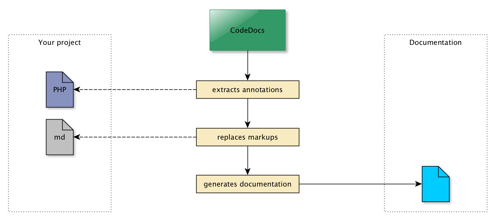

Have you ever dreamed of a **documentation** that automatically changes along with your code?
**CodeDocs** makes it possible!

## What is CodeDocs?

It is a tool that allows you to write your documentation **directly inside your code**.
The documentations must be written using **markdown** syntax and can be placed
inside **md-files** or **Doc Comments**.
If you want to see an example, just have a look at this documentation.
It was also created by CodeDocs itself.

## How does it work?

There are basically two kinds of components making all this possible.
[Annotations](/usage/annotations) and [Markups](/usage/markups).
**Annotations** are placed in your Doc Comments allowing you to remember these references for later use.
**Markups** are placed in your markdown documentation to dynamically fill its content.
Markups have access to all parsed classes and their annotations.

## Generate HTML

CodeDocs does **not** generate HTML-Code out of the box. It exports **markdown files** to a configured directory.
But it is possible to use [Processors](/usage/processors).
You can use a **Processor** to copy the exported markdown files to a Flat File CMS for example.
Or you can write your own Processor which generates static HTML using what ever you want.

>>>>> This documentation uses the Flat File CMS [Grav](https://getgrav.org/)
>>>>> together with the [RTFM Skeleton](https://github.com/getgrav/grav-skeleton-rtfm-site).
>>>>> The generated markdown files are just copied into the _user/pages/_ folder of this CMS.
